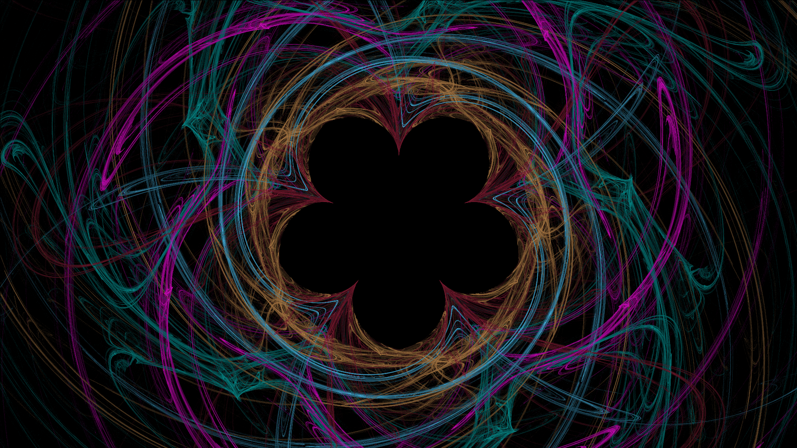

# FractalArtify

## Описание проекта

Этот проект реализует генератор фрактального пламени с возможностью последовательного и параллельного рендеринга. Пользователь может настраивать различные параметры генерации, включая количество итераций, количество уравнений, разрешение изображения, а также выбирать вариации для создания уникальных фрактальных изображений.

## Примеры фракталов

Ниже приведены примеры фрактальных изображений, которые можно создать с помощью данного генератора:

## Основные возможности

- **Последовательный рендеринг**: позволяет рендерить изображение в одном потоке.
- **Параллельный рендеринг**: ускоряет процесс рендеринга за счёт использования многопоточности.
- **Настраиваемые параметры**: пользователь может выбирать количество итераций, количество уравнений, разрешение и вариации для создания фрактала.
- **Сохранение изображений**: сгенерированные фракталы сохраняются в формате PNG в папке `output`.

## Доступные вариации

Фрактальные изображения создаются с использованием различных вариаций, которые изменяют форму и структуру фрактала. В проекте поддерживаются следующие вариации:

1. **Spherical**: Преобразует точки на сферической поверхности, создавая округлые формы.
2. **Disk**: Преобразует точки в дисковую структуру, создавая эффекты в виде концентрических кругов.
3. **Heart**: Преобразует точки, формируя сердцевидные фигуры.
4. **Polar**: Преобразует декартовы координаты в полярные, создавая эффект спиралей.
5. **Sinusoidal**: Применяет синусоидальное преобразование, создавая волнистые формы.

## Влияние параметров на генерацию фракталов

- **Количество итераций (Number of Iterations)**: Определяет количество повторений математического процесса, что влияет на сложность и детализацию изображения.
- **Количество уравнений (Number of Equations)**: Влияет на количество различных преобразований, используемых для создания фрактала.
- **Количество шагов итерации (Number of Iteration Steps)**: Контролирует точность отображения фрактала, где большее количество шагов даёт более точное изображение.
- **Разрешение по X и Y (Resolution for X and Y)**: Определяет размер итогового изображения по горизонтали и вертикали, что напрямую влияет на детализацию.
- **Количество симметрий (Number of Symmetries)**: Добавляет симметрию к фракталу, что может привести к созданию более упорядоченных и эстетически приятных изображений.

## Используемые технологии

- **Java**: основной язык программирования для реализации проекта.
- **Многопоточность**: для ускорения процесса рендеринга.
- **Вариации фракталов**: различные математические функции для создания уникальных фрактальных форм.
- **AWT (Abstract Window Toolkit)**: используется для работы с графикой и изображениями, включая создание и сохранение PNG-файлов.
